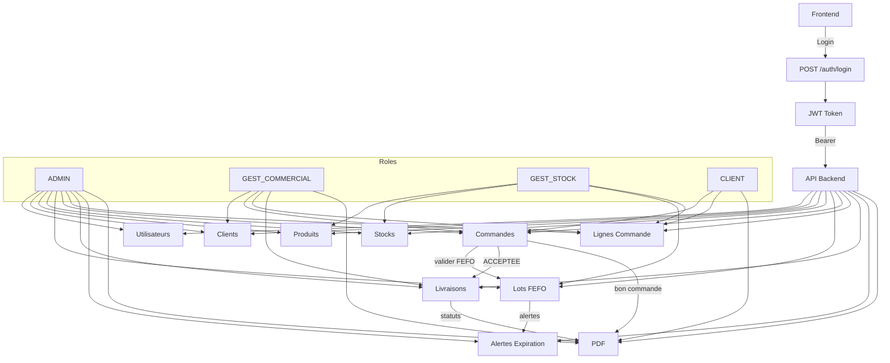

# Rapport backend - API Ferme Mokpokpo

Date: 2026-02-24

## 1) Vue d'ensemble
Le backend expose une API REST securisee par JWT. Les roles determinent les autorisations:
- ADMIN: tous droits
- GEST_COMMERCIAL: commandes, livraisons, clients
- GEST_STOCK: produits, stocks, lots (FEFO)
- CLIENT: ses commandes et ses infos

Authentification:
- POST /auth/login (OAuth2 form-data) -> access_token
- Header: Authorization: Bearer <token>

## 2) Utilisateurs et Clients
Utilisateurs:
- POST /utilisateurs/ (ADMIN pour roles eleves)
- GET /utilisateurs/ (ADMIN)
- GET /utilisateurs/{id} (ADMIN ou proprietaire)
- DELETE /utilisateurs/{id} (soft delete)

Clients:
- POST /clients/ (ADMIN ou proprietaire)
- GET /clients/ (ADMIN, GEST_COMMERCIAL)
- GET /clients/{id}
- DELETE /clients/{id} (soft delete)

## 3) Produits et Stock
Produits:
- POST /produits/ (ADMIN, GEST_STOCK)
- GET /produits/
- GET /produits/{id}
- DELETE /produits/{id} (bloque si lignes commande)

Stock:
- POST /stocks/ (ADMIN, GEST_STOCK)
- GET /stocks/ (ADMIN, GEST_STOCK, GEST_COMMERCIAL)
- GET /stocks/{id}
- DELETE /stocks/{id}

## 4) Lots et FEFO
Lots:
- POST /lots/ (ADMIN, GEST_STOCK)
- GET /lots/ (ADMIN, GEST_STOCK, GEST_COMMERCIAL)
- GET /lots/{id}
- PUT /lots/{id}
- DELETE /lots/{id}

FEFO:
- A la validation de commande, les lots sont selectionnes par date d'expiration la plus proche.
- Deduction automatique des quantites.
- Blocage si lot expire ou stock insuffisant.

## 5) Commandes et Lignes de commande
Commandes:
- POST /commandes/ (CLIENT, ADMIN)
- GET /commandes/ (ADMIN, GEST_COMMERCIAL)
- GET /commandes/{id}
- POST /commandes/{id}/valider (ADMIN, GEST_COMMERCIAL)
  - Applique FEFO, met statut a ACCEPTEE, cree la vente

Lignes:
- POST /ligne-commandes/ (ADMIN, CLIENT)
- GET /ligne-commandes/ (ADMIN, GEST_COMMERCIAL, GEST_STOCK)
- GET /ligne-commandes/{id}
- DELETE /ligne-commandes/{id}

## 6) Livraisons
- POST /livraisons/ (ADMIN, GEST_COMMERCIAL)
- GET /livraisons/ (ADMIN, GEST_COMMERCIAL)
- GET /livraisons/{id} (ADMIN, GEST_COMMERCIAL)
- PUT /livraisons/{id}/statut (ADMIN, GEST_COMMERCIAL)
- PUT /livraisons/{id} (ADMIN, GEST_COMMERCIAL)
- GET /livraisons/dashboard/stats (ADMIN, GEST_COMMERCIAL)

State machine:
- EN_PREPARATION -> PRETE -> EN_LIVRAISON -> LIVREE
- Timestamps auto: date_preparation, date_expedition, date_livraison

## 7) Alertes intelligentes (expiration)
- POST /alertes/scanner
- GET /alertes/expirations
- GET /alertes/dashboard
- POST /alertes/nettoyer

Scheduler:
- Scan quotidien 06:00 UTC
- Nettoyage hebdomadaire lundi 02:00 UTC

## 8) PDF
Bon de commande:
- GET /commandes/{id}/bon-pdf
- Contenu: infos commande, client, articles, total, QR

Bon de livraison:
- GET /livraisons/{id}/bon-livraison-pdf
- Contenu: infos livraison, adresse, transporteur, produits, QR

Logo:
- PDF_LOGO_SVG_BASE64 (logo integre en base64)
- PDF_LOGO_BASE64 (PNG base64)

## 9) Identifiants de test
Admin principal:
- slykokou@gmail.com / admin123

Comptes test:
- ADMIN: test.admin.20260224124700@mokpokpo.fr / testpass123
- GEST_STOCK: test.stock.20260224124700@mokpokpo.fr / testpass123
- GEST_COMMERCIAL: test.commercial.20260224124700@mokpokpo.fr / testpass123
- CLIENT: test.client.20260224125114@mokpokpo.fr / testpass123

## 10) Diagramme complet (flux et roles)

